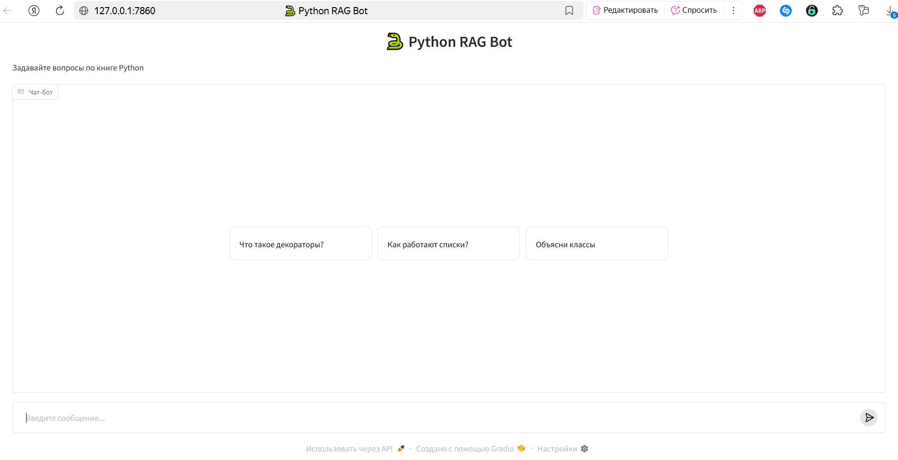

## Пример работы
### Встречающая страница
Основная страница чата выглядит так:

На ней предоставляется возможность выбрать либо вопросы-примеры, либо сразу же задать свой.

Выбор вопроса-примера происходит простым нажатием на него

После чат активируется, и бот сразу вам отвечает на выбранный вопрос.

Далее вы свободно можете задавать свои вопросы, например:

### Проверка тестового кейса
Проверим как теперь бот ответит с помощью LLM на запрос "Арифметические операторы в Python", который мы задавали для проверки работы поиска релевантных "ответов" (чанков) из векторной базы. Тогда программы вывела:

Бот же отвечает так:
.JPG)

Страница из книги:

